#ECOMMERCE PROJECT
Description of the Project
The website we plan to create is an online storefront called VaalElectronics. It attempts 
to address the issue of providing clients with easy access to high-quality electrical 
devices and appliances. People frequently lack the time to physically visit 
establishments in today's fast-paced world, as a result, an online platform provides the 
perfect remedy. 
VaalElectronics will offer a variety of electronic goods, such as accessories, computers, 
smart-phones, and home appliances. The website will act as a central location where 
clients can conveniently browse, compare, and buy electronic goods from the 
convenience of their homes.
B. Goals
i. Organizational Goal(s): Establishing VaalElectronics as a premier online retailer for 
electronic goods with fast shipping around the world, secure transactions, and ensuring 
a seamless customer experience are the organization's aim.
ii. User Goal(s): Our users’ goals is to offer users a user-friendly interface that will make 
it simple for them to search for products, obtain in-depth information, compare pricing, 
and decide on purchases they want to do. We want our users to be able to shop for any 
electronic or appliance they want from the comfort of their homes.
iii. Website Goal(s): Our website's objective is to develop an aesthetically appealing 
website with simple navigation, rapid page loads, and secure payment gateways that 
will build trust and promote repeat business. Our website should have a fast responsive 
user interface.

site map

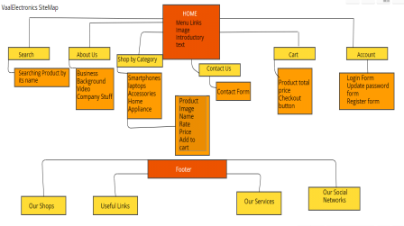

Home page
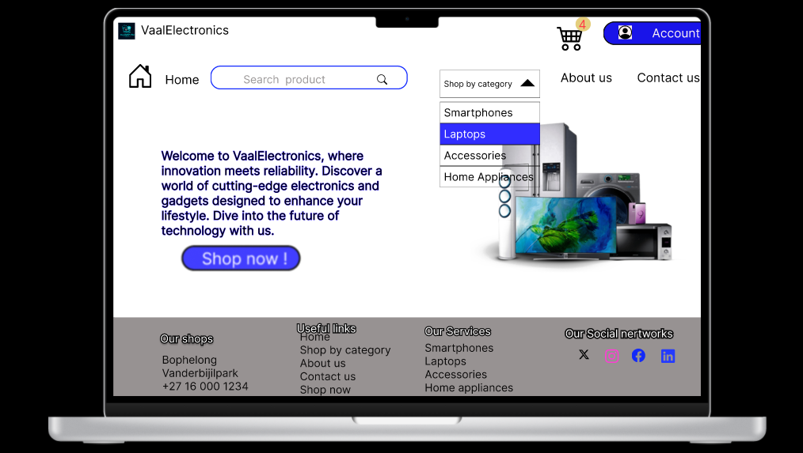

ACCOUNT

Registration Form

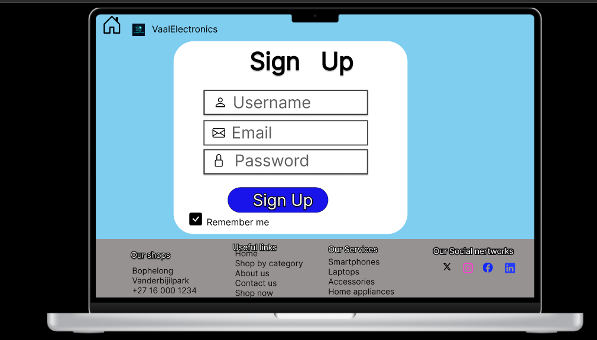

Login Form
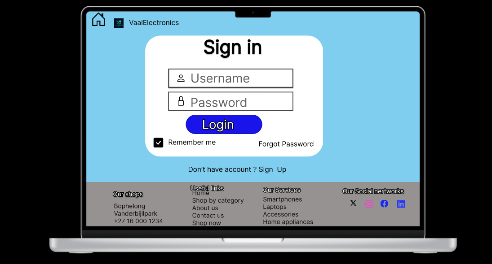

Update-Password
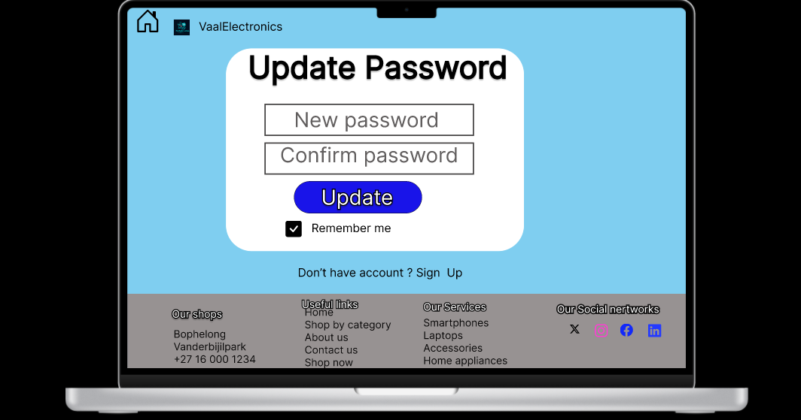

All Product Page
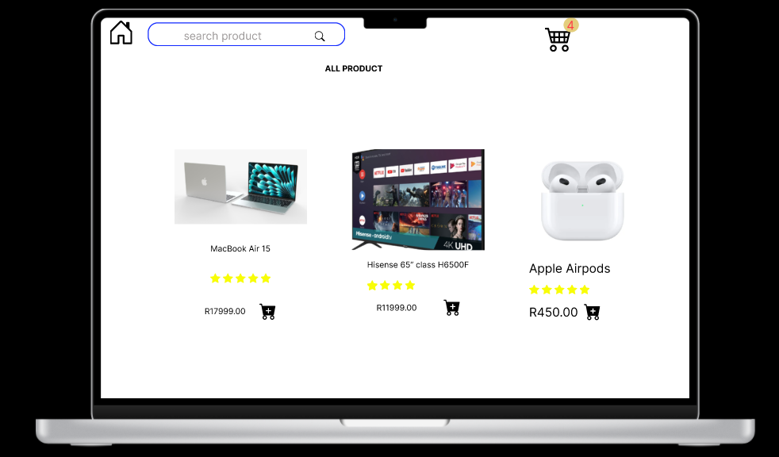

Smartphones Page
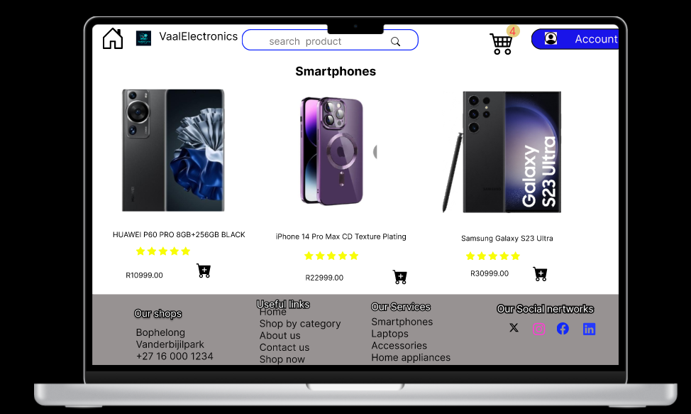

Laptops Page
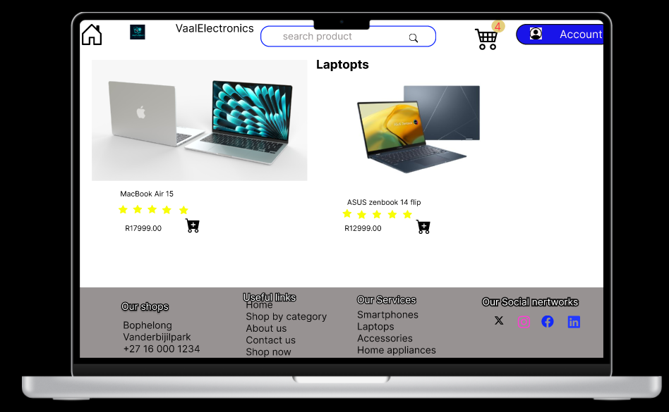

Accessories Page
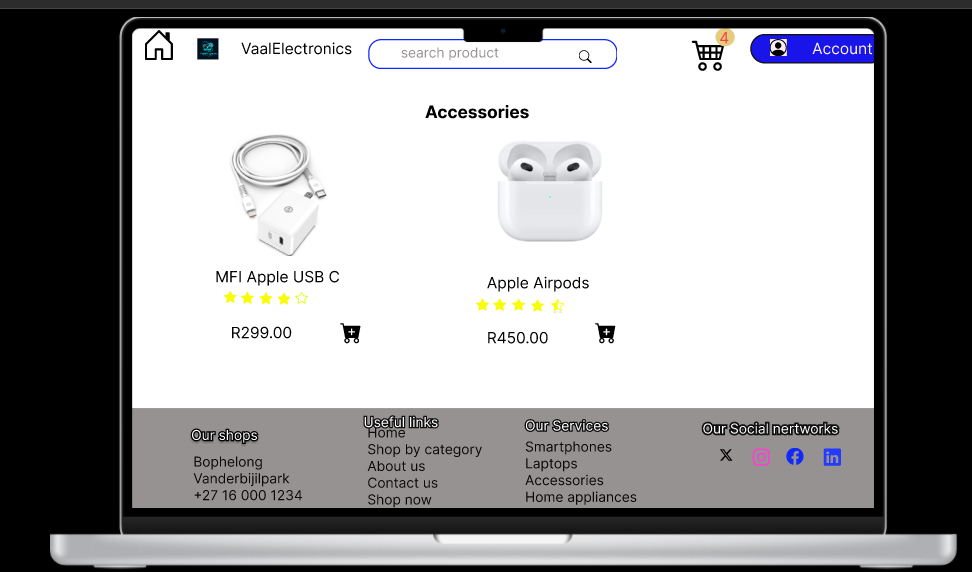

Home Appliances
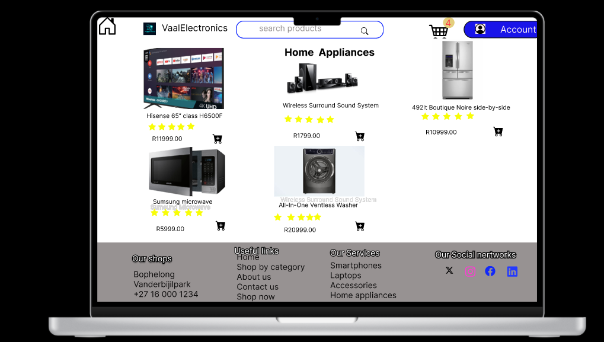

Shopping-cart page
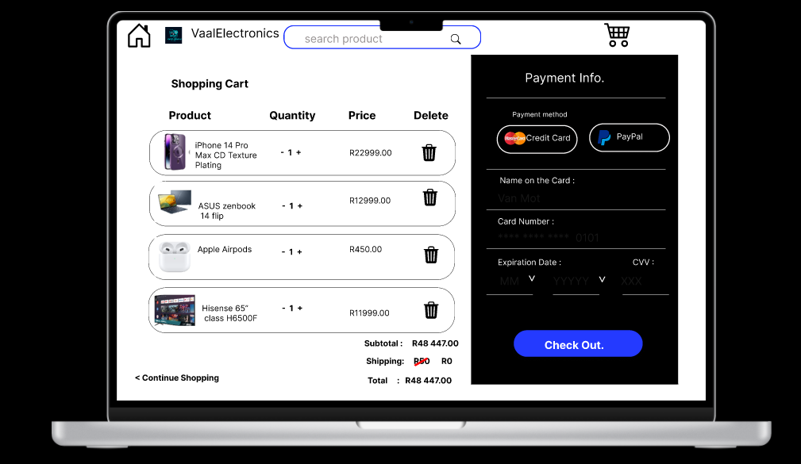

About Us page
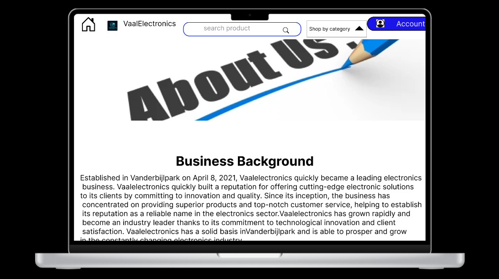

Contact Us page
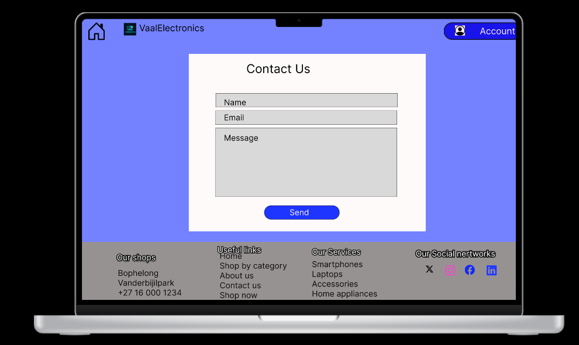

In conclusion, the journey of creating VaalElectronics has been thrilling. The project 
gave us the opportunity to comprehend the challenges of developing an intuitive Ecommerce platform, particularly in the cutthroat sector. VaalElectronics strives to not 
just meet the clients’ expectations but also exceed them by putting a strong emphasis 
on a seamless user experience, educational material, and secure transactions.
While working on this project, we’ve learned a lot about the E-commerce industry, 
which has reinforced the significance of user-centric design and strong content strategy 
in online enterprises. Our technical proficiently has improved as a result of building the 
website, but our comprehension of consumers behavior and market expectations in the 
digital age has also grown

